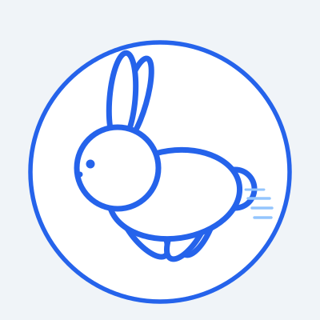
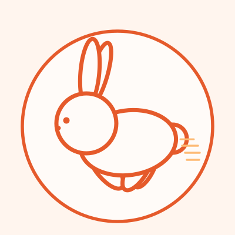
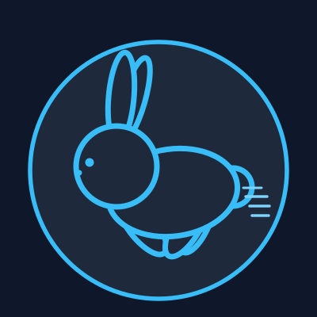
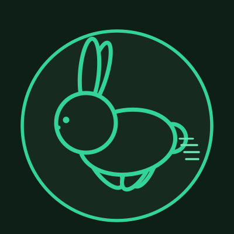

  

  # Cogna

  **Code insight for every codebase.**

  Cogna is a code insight solution that explains any codebase through human-machine interaction and builds excellent document engineering.

---

## Logo Options

Minimalist line-art running rabbit in a circle badge — two options per theme:

### 🌤 Light themes

| Preview | File | Accent |
|---------|------|--------|
|  | `assets/logo-rabbit-light-1.svg` | Blue `#2563EB` on white / light-blue canvas |
|  | `assets/logo-rabbit-light-2.svg` | Coral `#E55A2B` on off-white / warm-cream canvas |

### 🌙 Dark themes

| Preview | File | Accent |
|---------|------|--------|
|  | `assets/logo-rabbit-dark-1.svg` | Cyan `#38BDF8` on dark-navy canvas |
|  | `assets/logo-rabbit-dark-2.svg` | Emerald `#34D399` on dark-forest-green canvas |
