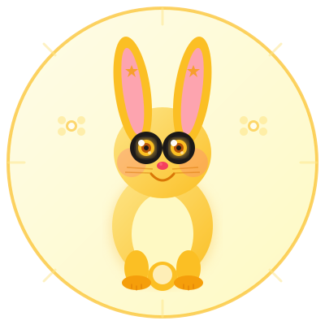
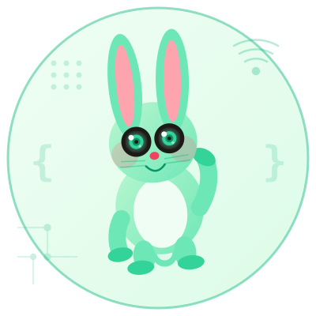
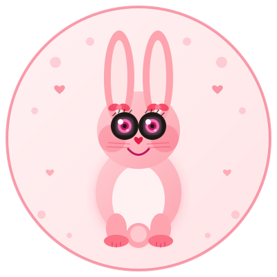

  

  # Cogna

  **Code insight for every codebase.**

  Cogna is a code insight solution that explains any codebase through human-machine interaction and builds excellent document engineering.

---

## Logo Options

Four bright, cute rabbit logo candidates — each with a distinct pose and tech-inspired decoration:

| Preview | File | Pose | Tech Accent |
|---------|------|------|-------------|
|  | `assets/logo-rabbit.svg` | 🐰 **Coding** — arms on keyboard, focused expression | Circuit traces · `</>` symbol |
|  | `assets/logo-rabbit-yellow.svg` | 🌟 **Leaping** — body tilted mid-dash, ears swept back | Binary digits · circuit nodes · speed lines |
|  | `assets/logo-rabbit-mint.svg` | 🌿 **Waving** — right arm raised high, friendly lean | `{ }` brackets · WiFi arcs · dot matrix |
|  | `assets/logo-rabbit-pink.svg` | 💕 **Thinking** — paw to chin, eyes looking upward | Hex grid · thought bubble with `010` binary |
