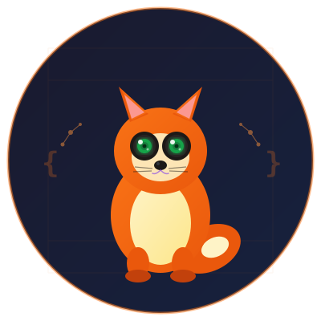
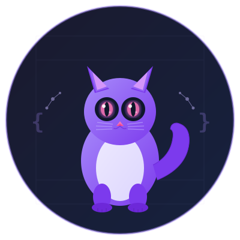
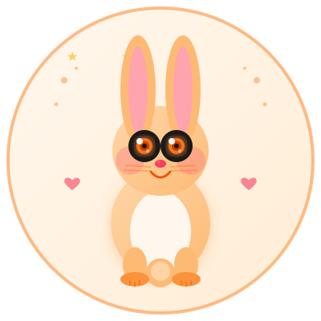
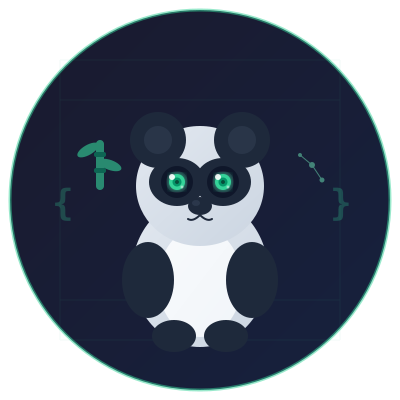

  

  # Cogna

  **Code insight for every codebase.**

  Cogna is a code insight solution that explains any codebase through human-machine interaction and builds excellent document engineering.

---

## Logo Options

Multiple animal logo designs are available to choose from. All logos share a consistent dark-background circular style with subtle code/tech decorative elements.

| Preview | File | Animal |
|---------|------|--------|
|  | `assets/logo.svg` | 🦉 Owl (current) |
|  | `assets/logo-fox.svg` | 🦊 Fox |
|  | `assets/logo-cat.svg` | 🐱 Cat |
|  | `assets/logo-rabbit.svg` | 🐰 Rabbit |
|  | `assets/logo-panda.svg` | 🐼 Panda |
